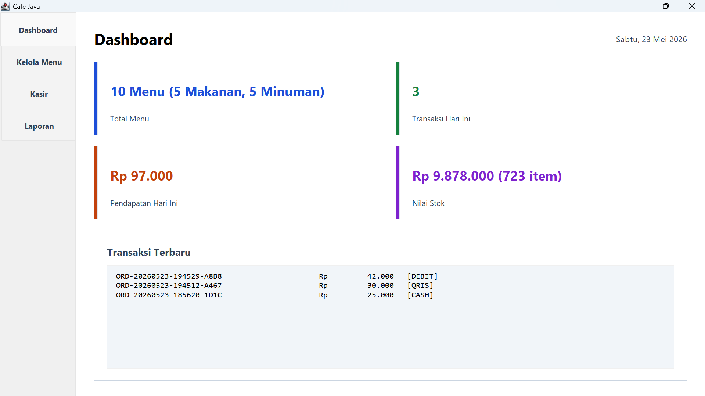
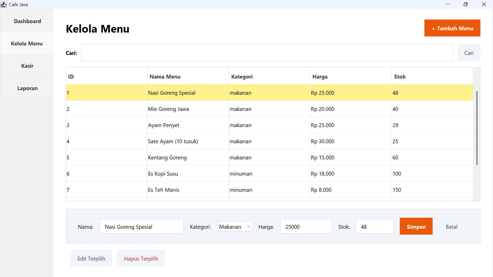
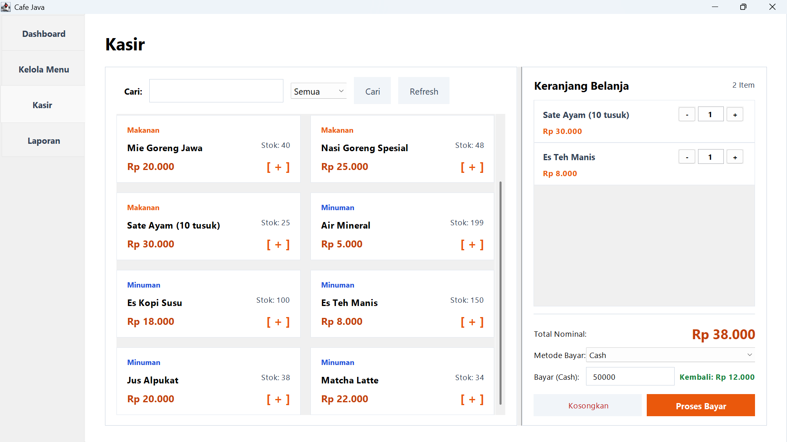
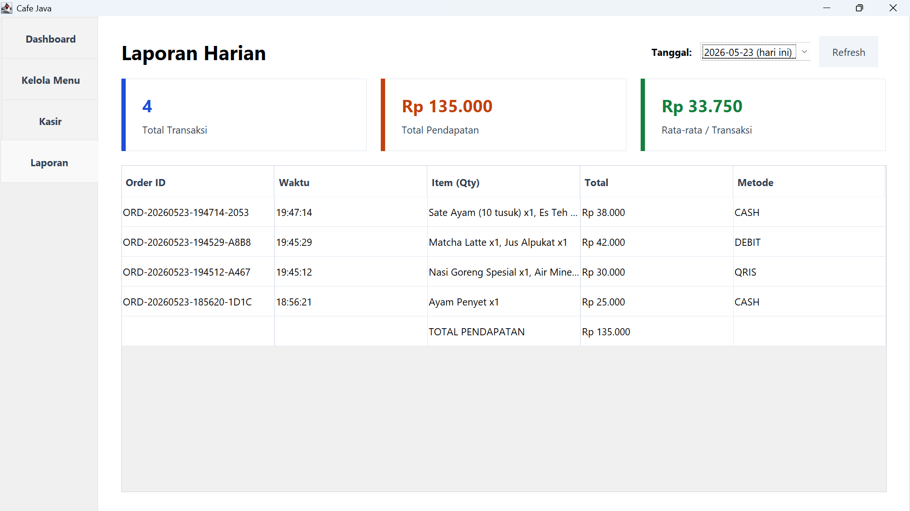
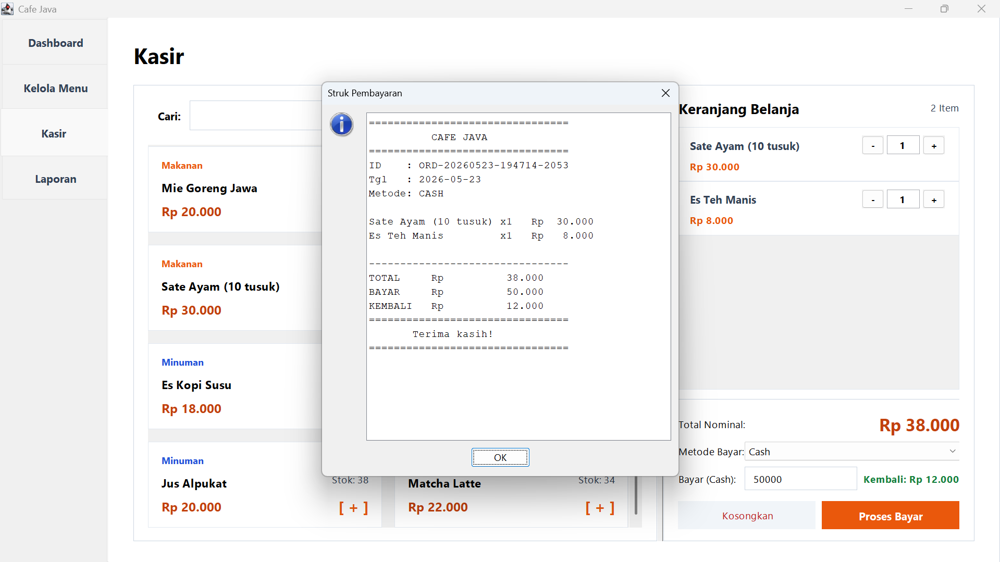

# ☕ Cafe Java — Sistem Kasir Cafe Sederhana

Aplikasi desktop **Point of Sale (POS)** untuk cafe kecil berbasis **Java Swing + MySQL (JDBC)**.

---

## 📸 Screenshot Aplikasi

### Dashboard


### Kelola Menu


### Kasir


### Laporan Harian


### Struk Pembayaran


---

## ✨ Fitur

### 1. Dashboard
Ringkasan bisnis cafe secara real-time:
- Total menu aktif (beserta jumlah makanan & minuman)
- Jumlah transaksi hari ini
- Total pendapatan hari ini
- Total nilai stok
- Daftar transaksi terbaru
- Notifikasi menu dengan stok rendah (<=5)

### 2. Kelola Menu (CRUD)
Pengelolaan data menu makanan dan minuman:
- **Create** — Tambah menu baru (nama, kategori, harga, stok)
- **Read**   — Lihat semua menu dalam tabel, lengkap dengan pencarian
- **Update** — Edit data menu yang sudah ada
- **Delete** — Hapus menu (riwayat transaksi tetap tersimpan dengan label "dihapus")
- **Search** — Cari menu berdasarkan nama atau kategori

### 3. Kasir
Panel transaksi utama untuk melayani pembeli:
- **Grid Menu** — Tampilan menu dalam bentuk kartu, klik untuk menambah ke keranjang
- **Filter & Search** — Filter berdasarkan kategori (Semua / Makanan / Minuman) dan cari nama
- **Keranjang Belanja** — Setiap item punya tombol +/- untuk atur jumlah, subtotal otomatis
- **3 Metode Pembayaran** — Cash (dengan perhitungan kembalian), QRIS, dan Debit
- **Struk Digital** — Struk tercetak di dialog setelah transaksi berhasil
- **Validasi Stok** — Mencegah pembelian melebihi stok tersedia

### 4. Laporan Harian
Riwayat dan ringkasan transaksi per tanggal:
- **Pilih Tanggal** — Dropdown berisi semua tanggal yang memiliki transaksi
- **Ringkasan** — Total transaksi, total pendapatan, rata-rata per transaksi
- **Tabel Detail** — Setiap order dengan ID, waktu, item yang dibeli, total, dan metode bayar
- **Total Baris** — Baris ringkasan TOTAL PENDAPATAN di akhir tabel

---

## 🛠️ Tech Stack

| Komponen | Teknologi | Keterangan |
|----------|----------|------------|
| **Bahasa** | Java 17+ | Bahasa utama aplikasi |
| **GUI** | Swing (`javax.swing`) | Framework GUI bawaan Java — JFrame, JTabbedPane, JTable, JPanel, JSplitPane |
| **Database** | MySQL | Database relasional untuk menyimpan data menu, order, dan detail transaksi |
| **Koneksi DB** | JDBC (`mysql-connector-java`) | Driver Java untuk koneksi ke MySQL, menggunakan `PreparedStatement` dan manajemen transaksi (`commit`/`rollback`) |
| **Arsitektur** | MVC + DAO + Singleton | **Model** (MenuItem, Order, OrderDetail), **View** (MainFrame), **Controller** (validasi + logic), **DAO** (Database.java — semua query terpusat), **Singleton** (satu koneksi database) |

---

## 🗄️ Struktur Database

Aplikasi menggunakan **3 tabel** relasional:

### 1. Tabel `menu`
Menyimpan data menu makanan dan minuman.

| Kolom | Tipe | Keterangan |
|-------|------|-----------|
| `id` | INT AUTO_INCREMENT | Primary key |
| `name` | VARCHAR(100) | Nama menu |
| `category` | ENUM('makanan','minuman') | Kategori |
| `price` | DECIMAL(10,2) | Harga satuan |
| `stock` | INT | Jumlah stok tersedia |
| `created_at` | TIMESTAMP | Waktu dibuat (auto) |
| `updated_at` | TIMESTAMP | Waktu diupdate (auto) |

### 2. Tabel `orders`
Menyimpan header transaksi.

| Kolom | Tipe | Keterangan |
|-------|------|-----------|
| `id` | VARCHAR(30) | Primary key (format: ORD-YYYYMMDD-HHMMSS-XXXX) |
| `total` | DECIMAL(10,2) | Total harga transaksi |
| `payment_method` | ENUM('cash','qris','debit') | Metode pembayaran |
| `payment_amount` | DECIMAL(10,2) | Jumlah uang dibayarkan |
| `change_amount` | DECIMAL(10,2) | Kembalian (0 untuk non-cash) |
| `order_date` | DATE | Tanggal transaksi |
| `created_at` | TIMESTAMP | Waktu pencatatan (auto) |

### 3. Tabel `order_details`
Menyimpan detail item per transaksi. Relasi ke `orders` dan `menu`.

| Kolom | Tipe | Keterangan |
|-------|------|-----------|
| `id` | INT AUTO_INCREMENT | Primary key |
| `order_id` | VARCHAR(30) | Foreign key → `orders.id` (ON DELETE CASCADE) |
| `menu_id` | INT | Foreign key → `menu.id` (ON DELETE SET NULL) |
| `menu_name` | VARCHAR(100) | Nama menu (disimpan agar riwayat tetap ada walau menu dihapus) |
| `price` | DECIMAL(10,2) | Harga saat transaksi |
| `quantity` | INT | Jumlah item |
| `subtotal` | DECIMAL(10,2) | price × quantity |

### Relasi
```
orders (1) ──< (N) order_details (N) >── (1) menu
```

---

## 🧱 Konsep OOP

| Konsep | Implementasi |
|--------|-------------|
| **Encapsulation** | Semua model class menggunakan `private` fields + getter/setter |
| **Singleton Pattern** | Class `Database` — satu koneksi untuk seluruh aplikasi |
| **DAO Pattern** | Semua operasi database terpusat di `Database.java` |
| **MVC Pattern** | Model (`Models.java`) → Controller (`Controller.java`) → View (`MainFrame.java`) |
| **Separation of Concerns** | GUI tidak langsung akses database; semua lewat Controller |
| **Transaction Management** | `conn.setAutoCommit(false)` + `commit()` / `rollback()` untuk operasi multi-tabel |

---

## 📁 Struktur Project

```
CafeJava/
├── README.md
├── database.sql                     ← DDL + seed data 10 menu
├── screenshots/                     ← Folder untuk screenshot
│   ├── dashboard.png
│   ├── kelola-menu.png
│   ├── kasir.png
│   ├── laporan.png
│   └── struk.png
├── lib/
│   └── mysql-connector-j-9.7.0.jar ← JDBC driver
└── src/CafeJava/
    ├── Main.java                    ← Entry point
    ├── Database.java                ← JDBC connection + semua query
    ├── Models.java                  ← MenuItem, Order, OrderDetail
    ├── Controller.java              ← Validasi + business logic
    └── MainFrame.java               ← GUI 4 tab
```

---

## 👥 Anggota Kelompok

| Nama | Tugas Utama |
|------|------------|
| **Alexander Surya Paskah** | Database (JDBC, SQL, CRUD, Report Query) |
| **Joseph Christian Newell Pranoto** | GUI (Swing, MainFrame, semua panel/tab) |
| **Kevin Nathaniel Wijaya** | Model, Controller, Validasi, Integrasi, Dokumentasi |

---

## 🔧 Cara Menjalankan

### Prasyarat
- **Java 17+** terinstall
- **MySQL** sudah running
- File `mysql-connector-j-9.7.0.jar` di folder `lib/`

### Step by Step

```bash
# 1. Buat database di MySQL
mysql -u root -p < database.sql

# 2. Compile
javac -cp "lib/mysql-connector-j-9.7.0.jar" -d out src/CafeJava/*.java

# 3. Run (Windows)
java -cp "out;lib/mysql-connector-j-9.7.0.jar" CafeJava.Main

# 3. Run (Linux/Mac)
java -cp "out:lib/mysql-connector-j-9.7.0.jar" CafeJava.Main
```

> **Konfigurasi database** di `Database.java` baris 17-21: sesuaikan `DB_HOST`, `DB_PORT`, `DB_NAME`, `DB_USER`, `DB_PASS` dengan setting MySQL kamu.
